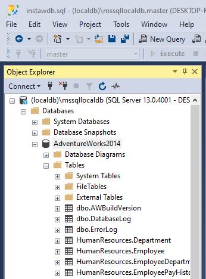

# Reporting Services

A labor során egy új eszközzel, a _Microsoft SQL Server Reporting Services_-zel ismerkedünk meg, így a labor részben vezetett. Az első feladat laborvezetővel együtt megoldott, a továbbiak önálló feladatok. A közös feladatmegoldás és az önálló feladatmegoldás eredményét is be kell adni.

## Előfeltételek, felkészülés

A labor elvégzéséhez szükséges eszközök:

- Windows. Használható a BME Cloud (<https://cloud.bme.hu>) is, lásd [itt](../bme-cloud-vm.md).
- Microsoft SQL Server: Express változat ingyenesen használható, avagy Visual Studio mellett feltelepülő _localdb_ változat is megfelelő
- [SQL Server Management Studio](https://docs.microsoft.com/en-us/sql/ssms/download-sql-server-management-studio-ssms)
- Az adatbázist létrehozó script: [adventure-works-2014-oltp-script.zip](adventure-works-2014-oltp-script.zip)
- Microsoft Visual Studio 2019: Community verzió is megfelelő
- Report Server Projekt támogatás Visual Studio-hoz: [Microsoft Reporting Services Projects extension](https://marketplace.visualstudio.com/items?itemName=ProBITools.MicrosoftReportProjectsforVisualStudio) (Érdemes [frissen tartani](https://docs.microsoft.com/en-us/visualstudio/extensibility/how-to-update-a-visual-studio-extension?view=vs-2019) ezt az extension-t, mert gyakran van belőle kiadás.)
- GitHub account és egy git kliens

A labor elvégzéséhez használható segédanyagok és felkészülési anyagok:

- Microsoft SQL Server használata: [leírás](https://bmeviauac01.github.io/adatvezerelt/db/mssql/) és [videó](https://web.microsoftstream.com/video/e3a83d16-b5c4-4fe9-b027-703347951621)
- SQL Reporting Services [hivatalos tutorial](https://docs.microsoft.com/en-us/sql/reporting-services/create-a-basic-table-report-ssrs-tutorial)

## Előkészület

A feladatok megoldása során ne felejtsd el követni a [feladat beadás folyamatát](../GitHub.md).

### Git repository létrehozása és letöltése

1. Az alábbi URL-en keresztül hozd létre a saját repository-dat: <https://classroom.github.com/a/gTzzXDJN>

1. Várd meg, míg elkészül a repository, majd checkout-old ki.

    !!! tip ""
        Egyetemi laborokban, ha a checkout során nem kér a rendszer felhasználónevet és jelszót, és nem sikerül a checkout, akkor valószínűleg a gépen korábban megjegyzett felhasználónévvel próbálkozott a rendszer. Először töröld ki a mentett belépési adatokat (lásd [itt](../GitHub-credentials.md)), és próbáld újra.

1. Hozz létre egy új ágat `megoldas` néven, és ezen az ágon dolgozz.

1. A `neptun.txt` fájlba írd bele a Neptun kódodat. A fájlban semmi más ne szerepeljen, csak egyetlen sorban a Neptun kód 6 karaktere.

### Adventure Works 2014 adatbázis létrehozása

A feladatok során az _Adventure Works_ minta adatbázissal dolgozunk. Az adatbázis egy kereskedelmi cég értékesítéseit tartalmazza, amelyből mi a teljes adatbázis megértése helyett előre definiált lekérdezésekkel dolgozunk csak, melyek termékek eladásainak adatait tartalmazza.

1. Töltsd le és csomagold ki az [adventure-works-2014-oltp-script.zip](adventure-works-2014-oltp-script.zip) fájlt a `c:\work\Adventure Works 2014 OLTP Script` könyvtárba (hozd létre a könyvtárat, ha nem létezik).

    !!! important ""
        Mindenképpen ez a mappa legyen, különben az sql fájlban az alábbi helyen ki kell javítani a könyvtár elérési útvonalát:

        ```sql
        -- NOTE: Change this path if you copied the script source to another path
        :setvar SqlSamplesSourceDataPath "C:\work\Adventure Works 2014 OLTP Script\"
        ```

        Ha beleszerkesztesz az elérési útvonalba, ügyelj hogy a végén maradjon perjel!

1. Kapcsolódj Microsoft SQL Serverhez SQL Server Management Studio segítségével. Az alábbi adatokkal kapcsolódj.

    - Server name: `(localdb)\mssqllocaldb` LocalDB esetén, vagy `localhost\sqlexpress` SQL Express használatakor
    - Authentication: `Windows authentication`

1. A _File / Open / File..._ menüpont használatával nyisd meg az előbbi mappából az `instawdb.sql` fájlt. **Még ne futtasd!** Előbb kapcsold be az SQLCMD módot: a _Query_ menüben _SQLCMD Mode_, és csak ezt követően válasszuk az _Execute_ lehetőséget.

    

1. Ellenőrizd, hogy létrejött-e az adatbázis és a táblák. Ha a baloldali fában a _Databases_-en _Refresh_-t nyomsz, meg kell jelenjen az _AdventureWorks2014_ adatbázis a listában, és alatta számtalan tábla.

    .

1. Nyiss egy új SQL Query ablakot ezen az adatbázison (az adatbázison jobb egérrel kattintva _New query_), és futtasd le az alábbi SQL utasítást **a saját Neptun kódodat** behelyettesítve:

    ```sql
    update Production.Product set Name='NEPTUN'+Name
    ```

    Ellenőrizd a `Production.Product` tábla tartalmát, hogy a Neptun kódod ott van-e a nevek elején: jobb egérrel kattintás a táblán és _Select top 1000 rows_.

    !!! warning "FONTOS"
        Fontos, hogy szerepeljen a Neptun kód a nevekben. A feladatok során képernyőképeket kérünk, amelyen szerepelnie **kell** a Neptun kódodnak.
